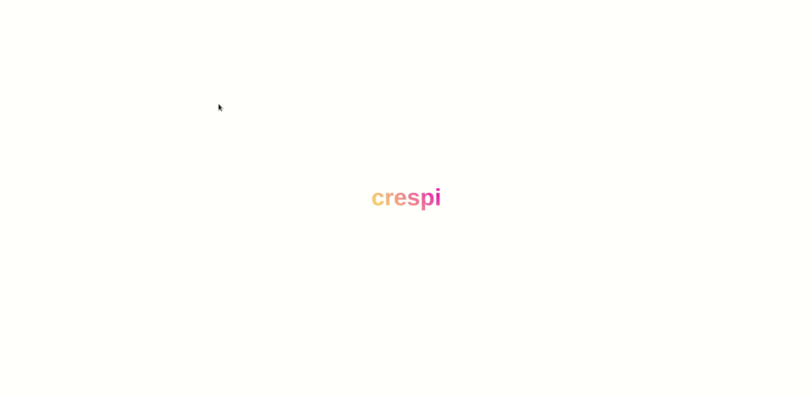

# crespi

With the exponential growth of new technologies, the real world is

experiencing a strong virtualization: from the cafeteria to the barber’s

shop, everything has a webpage.


We have tried to imagine how the internet of the future will likely be,

starting from the look of a normal website to build something new,

closer to reality. Here is how we tried.


## Contents

* [Overview](#overview)
* [Support](#support)
* [Design](#design)
* [Technologies](#technologies)
  + [Development dependencies](#development-dependencies)
  + [Dependencies](#dependencies)
* [Development cycle](#development-cycle)
* [Our mission is to make the world part of the web](#our-mission-is-to-make-the-world-part-of-the-web)
* [Join the team](#Join-the-team)

## Overview

<p align="center" height="50%" width="100%">

  

The project was aimed at producing a site that uses the third dimension

to create a realistic effect.


Opening the site, we will find three-dimensional models on the screen

that represent the main monuments of the workers' village of Crespi

d’Adda.


Moving the mouse or a finger over the models, a container will appear at

the bottom of the screen, above which is written the name of the

monument plus a short description.


Clicking on the container, shows a page with 360° photos and some

information about the monument.


In the top right corner, there is a button with the icon "?". Here, you

can find some information about the project.


 ## Support

The development of the application started in October 2018. From the

outset, we have been decided to produce a free application that could

run on any device. And for this purpose, what could be better than the

web?


Infact, unlike classic applications (eg PowerPoint for Windows),

websites work the same way, on any device, directly from the browser,

without requiring the installation of additional content.


## Design

To build a modern application has been one of the project goals.


Inspired by the rounded frames of the new mobile devices, the site has

circular buttons and text boxes without edges; the design of the site

uses a white background, to provide a visually light user experience.


It was thought to enhance a fundamental, often overlooked, feature of

today's sites: typography.


The choice of the character fell on the sans serif interface Helvetica

Neue. Iconic and widely used in the web, Helvetica is a font with modern

lines, a feature that makes it easily readable and adaptable to any

situation.


## Technologies

The strength of the project are the technologies used. We have selected

among the most modern and fast, to produce a latest generation product.


Here is a brief description of how dependencies work.


### Development dependencies

\-  Git and Github: version control system.

\-  Node.js: package manager and code executor on the local platform;

\-  Webpack;

\-  Eslint: validates the correct code formatting;

\-  Babel: translates the developed code into a version supported by all

  devices;

\-  Prettier: format the code before saving;

\-  Travis CI: continuous integration system;


### Dependencies

\-  React;

\-  Redux;

\-  Three.js;

\-  Styled-Components;


## Development cycle

The tools that stood out in the development process were certainly the

version control system (Git and Github) and the continuous integration

system (Travis CI).


### Git

Git has permitted to keep us track of the code development along the

project course.


### Travis CI

This tool has the role of executing the code in a remote machine in

order to verify the correct code behavior.


### Dependencies

#### Node

Dependency management was entrusted to Node.js which, in addition to

downloading and managing development dependencies, was responsible for

executing the code.


#### Webpack

The project, during the development phase, is compressed by Webpack:

this component compacts the contents of the project files, to create a

single file.


#### Babel

To meet the needs of each browser, Babel.js was used to compile the

code; in fact, Babel carries out a fundamental task in the development

of React: without it, it would not be possible to read the syntax of the

Jsx tags.


#### React

The entire project is based on React, the framework used to write Html,

in javascript files. Besides the possibility of interacting with the

Html coding, using the logical constructs of a programming language,

React allows to build the entire project on a single page (unlike normal

sites), this speeds up the application behavior, as the content to be

displayed is dynamically loaded based on the request provided by the

user.


#### Three.js

At a higher level, you can find Three.js, a webgl based library, api

that allows you to interact with browser graphics.


The role of this component is to provide and manage the visualization of

three-dimensional models.


## Our mission is to make the world part of the web

Working on the development of the application made it possible to learn

new technologies by providing new tools and points of view farther from

the school environment: alike as the search for online documentation and

the importance of community support (eg Medium, Stackoverflow).


Nevertheless, learning programming topics was not the ultimate goal of

the project.


Infact, projects like this are where the entrepreneurial attitudes of

the individual emerge, to encourage individual creativity and to support

the group.


To bring the project to its final stage it was necessary to coordinate

and interact with different groups (photos and videos, modellers, texts,

to name a few).


Finding the right technologies and being able to apply them has required

the ability to select sources, in an environment full of information

such as the internet.


All this has been shaped by a vision aimed at offering a product

destined to involve young generations, through a new and bilateral

method, similar to the interaction with a real object, a missing

sensation in today's Internet.


Making the world part of the web is the leitmotiv of the project.


We have ventured into this difficult but exciting adventure, to allow

anyone the opportunity to visit, from the comfort of the home’s sofa, a

UNESCO site of undoubted interest.


## Join the team

```
git clone https://github.com/visionn/crespi
yarn
yarn start
```
